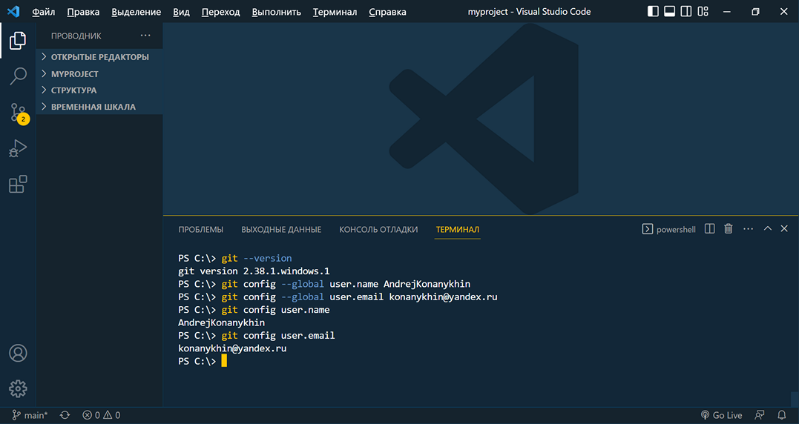
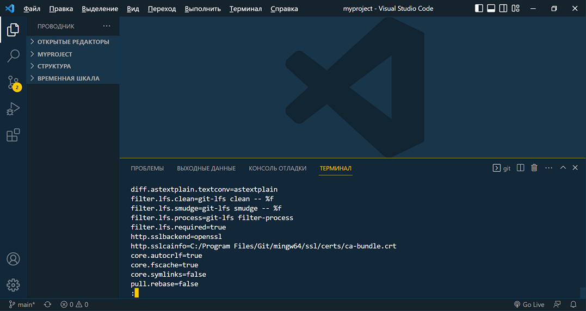
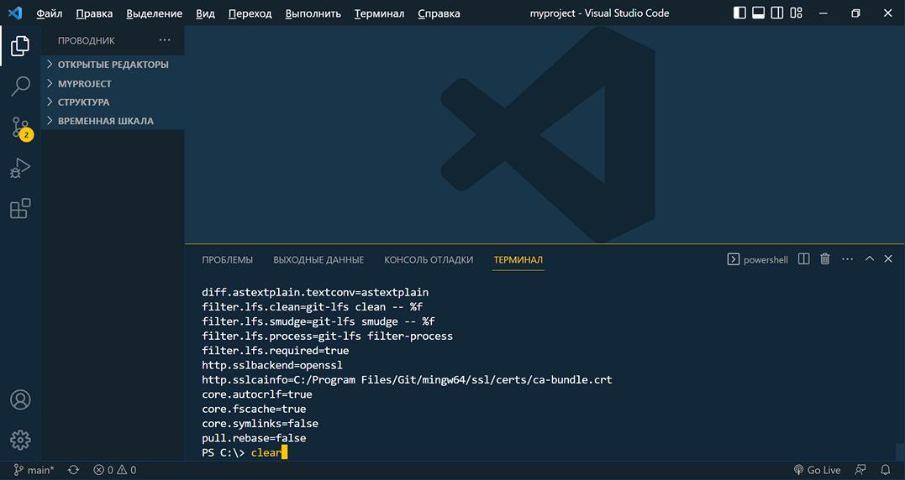
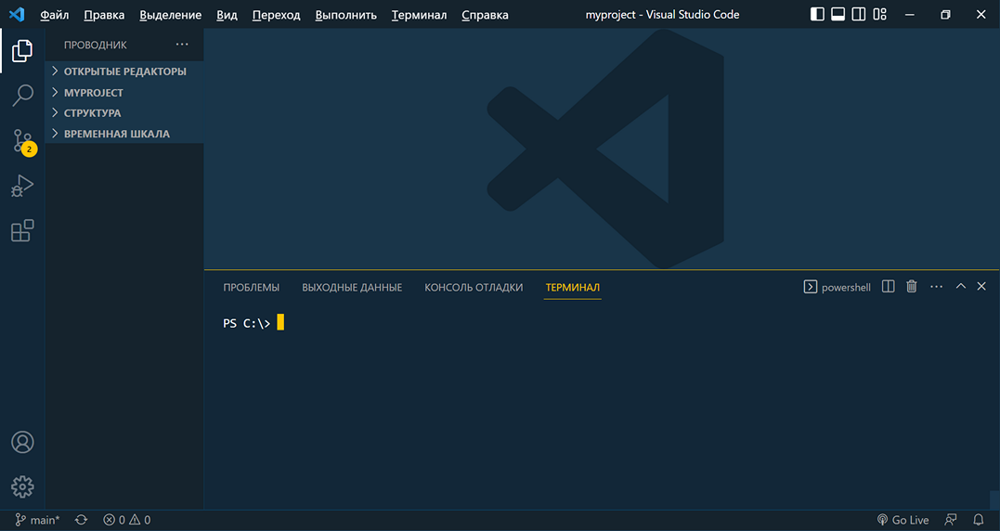

<style>h2{color:#ff4800}</style>

[<< К содержанию](readme.md)

---

## Настройка GIT

Перед началом работы нам необходимо настроить имя пользователя и email пользователя GIT (локального разработчика). Так как в дальнейшей работе мы будем создавать аккаунт на GitHub, рекомендуется использовать те же имя пользователя и почту, которые в дальнейшем будут использованы при регистрации, хотя допускаются совершенно разные имена и email'ы.

Для настройки имени пользователя и email используем команды:

```powershell
git config --global user.name [name]
git config --global user.email [email]
```


_Фото 6. Установка пользователя GIT_

Я ввел свои имя пользователя и почту. Если вы хотите ввести имя и фамилию через пробел - используйте кавычки.

Для проверки введенных настроек можно использовать команды:

```powershell
git config user.name
git config user.email
```


_Фото 7. Проверка настроек пользователя_

Видим, что настройки применены, продолжим работу.

Для просмотра других настроек GIT можно использовать команду:

```powershell
git config --list
```


_Фото 8. Проверка настроек GIT_

Для продолжения ввода команд, нажмем клавишу Q. Для очистки окна терминала можно использовать команду _clear_ (фото 9).


_Фото 9. Команда clear_

Результат применения команды _сlear_:


_Фото 10. Терминал очищен_

Теперь мы можем переходить к созданию проекта и локального репозитория.

---

[Далее >>](creating-local-repository.md)
