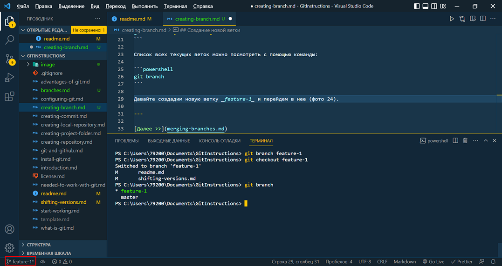
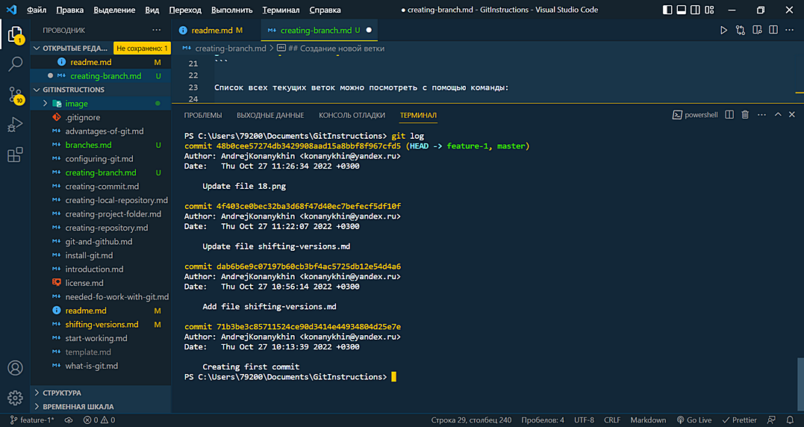
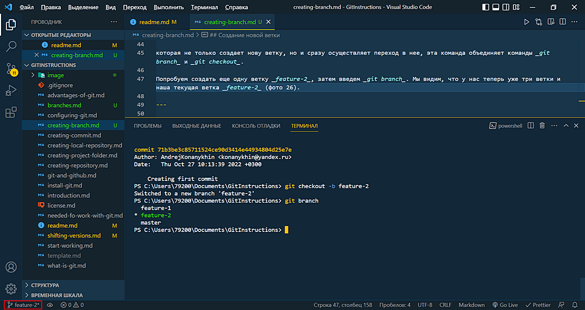
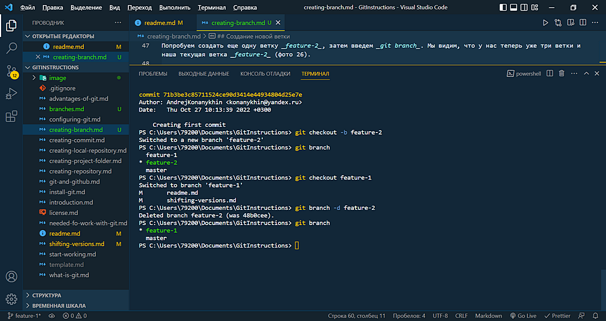

<style>h2{color:#ff4800}</style>

[<< К содержанию](readme.md)

---

## Создание новой ветки

Новая ветка в GIT создается командой:

```powershell
git branch [branch name]
```

где [branch name] - имя новой ветки. Ветки рекомендуется называть таким образом, чтобы из названия ветки было понятно, какой функционал разрабатывается в данной ветке.

После создания ветки переходим в нее с помощью команды:

```powershell
git checkout [branch name]
```

Список всех текущих веток можно посмотреть с помощью команды:

```powershell
git branch
```

Давайте создадим новую ветку _feature-1_ и перейдем в нее (фото 24). Мы видим, что у нас теперь две ветки _master_ и _feature-1_. Вывод в терминале и название ветки внизу слева в VS Code подсказывают нам, в какой ветке мы сейчас находимся.


_Фото 24. Создание ветки в GIT_

Введя команду _git log_ мы увидим те же самые коммиты, что и в ветке _master_, так как у этих веток одна история, и коммитов в ветке _feature-1_ мы еще не создавали (фото 25).


_Фото 25. Коммиты в ветке feature-1_

Кстати, для создания новой ветки в GIT есть еще команда:

```powershell
git checkout -b [branch name]
```

которая не только создает нову ветку, но и сразу осуществляет переход в нее, эта команда объединяет команды _git branch_ и _git checkout_.

Попробуем создать еще одну ветку _feature-2_, затем введем _git branch_. Мы видим, что у нас теперь уже три ветки и наша текущая ветка _feature-2_ (фото 26).


_Фото 26. Создание ветки feature-2_

Что же, острой необходимости в трех ветках у нас нет. Поэтому давайте перейдем в ветку _feature-1_, а ветку _feature-2_ удалим. Для удаления веток используется команда:

```powershell
git branch -d [branch name]
```

**Важно! Текущую ветку удалить нельзя. Сначала нужно перейти в другую ветку.** Поэтому предварительно мы перешли в ветку _feature-1_ (фото 27).


_Фото 27. Удаление ветки feature-2_

Следующая страница проекта о слиянии веток будет создана в ветке _feature-1_, а затем мы выполним слияние веток и переименование основной ветки _master_.

---

[Далее >>](merging-branches.md)
