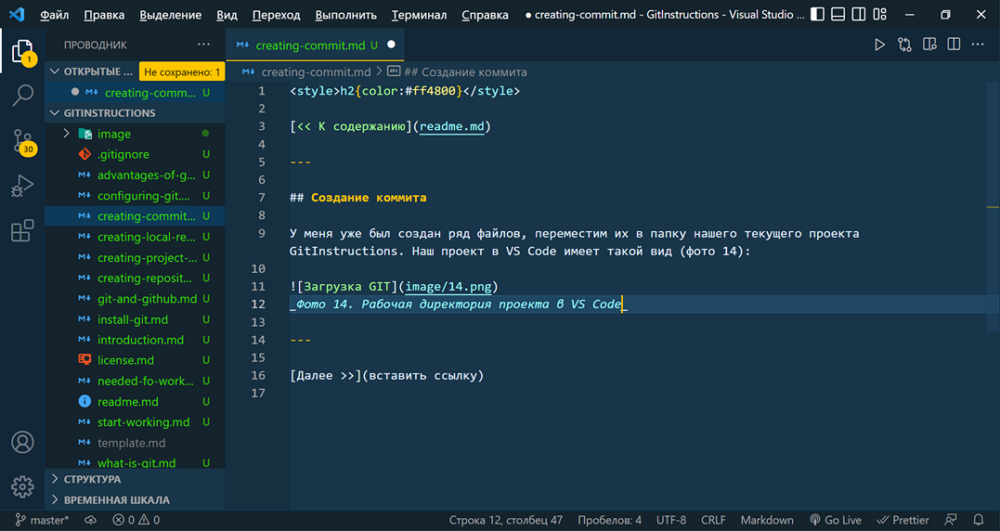
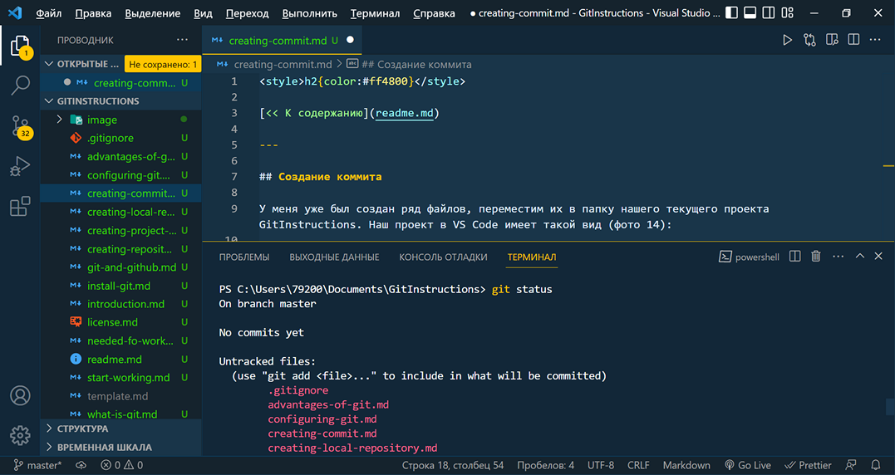
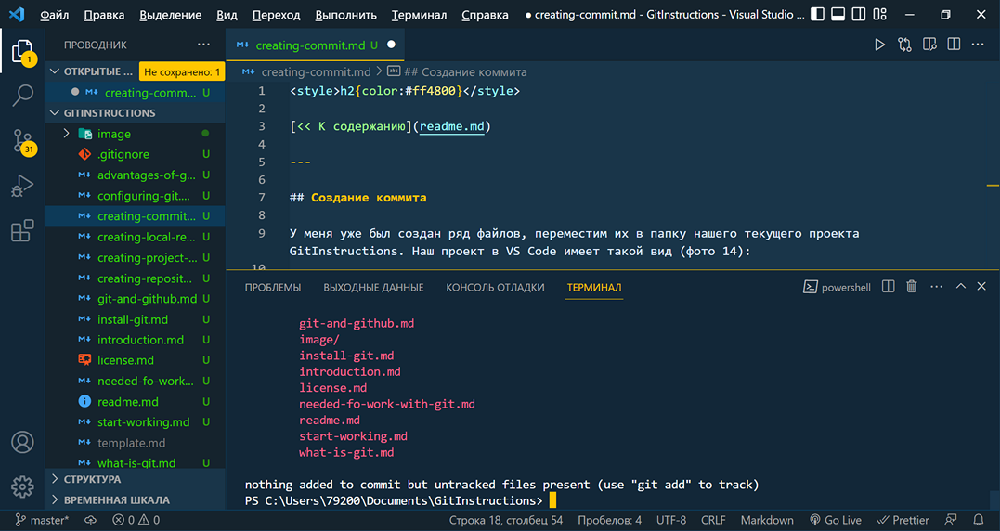
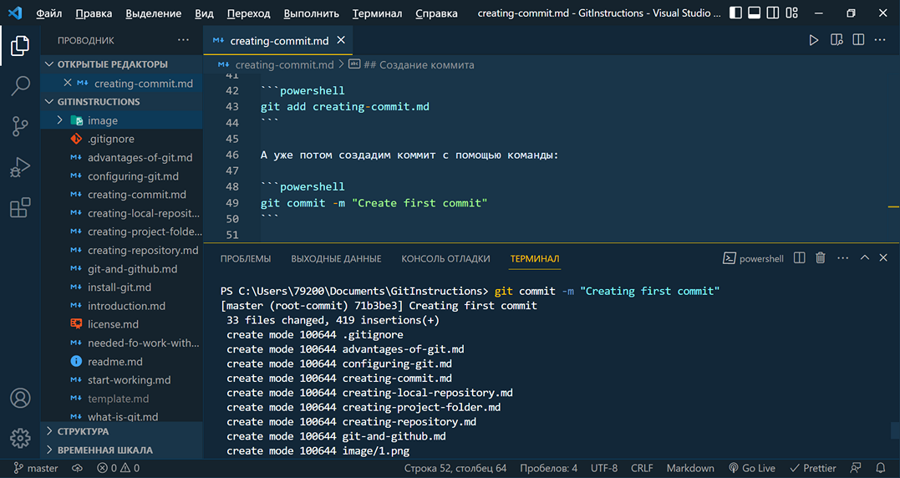

<style>h2{color:#ff4800}</style>

[<< К содержанию](readme.md)

---

## Создание коммита

У меня уже был создан ряд файлов, переместим их в папку нашего текущего проекта GitInstructions. Наш проект в VS Code имеет такой вид (фото 14):


_Фото 14. Рабочая директория проекта в VS Code_

Теперь у нас все готово для создания первого коммита, а именно сохранения текущей версии проекта. Проверить текущее состояние репозитория можно с помощью команды:

```powershell
git status
```

Откроем терминал, введем ее и посмотрим на результат (фото 15 и 16).


_Фото 15. Результат выполнения команды git status_


_Фото 16. Результат выполнения команды git status_

Мы видим, что в нашей рабочей ветке _master_ нет еще ни одного коммита, но есть ряд файлов и папок, обозначенных статусом _untracked_ (в VS Code такие файлы отмечены буквой U справа от имени файла), то есть эти файлы пока не отслеживаются GIT. Также нам предлагается добавить эти файлы и папки к отслеживаемым с помощью команды:

```powershell
git add .
```

Введем ее в терминал. Мы видим, что статус файлов проекта изменился на _added_ (буква А справа от имени файла), то есть теперь они подготовлены для создания коммита, но сам коммит еще не был создан. Проверим это с помощью команды:

```powershell
git status
```

Мы видим, что коммитов пока еще нет, но файлы проекта уже подготовлены для создания нашего первого коммита. Но уже после команды _git add._ я внес изменения в текущий файл, теперь он отмечен буквой М - _modified_, то есть при создании коммита, внесенные мной изменения не будут учтены. Сохраним изменения в файле и подготовим его для коммита с помощью команды:

```powershell
git add creating-commit.md
```

А уже потом создадим коммит с помощью команды:

```powershell
git commit -m "Create first commit"
```

Где выражение в кавычках - это описание коммита. В качестве описания рекомендуется коротко и ясно указывать, какие изменения были внесены в проект перед созданием коммита.

После выполнения команды _git commit -m [message]_ мы видим (фото 17), что в нашей ветке _master_ создан первый коммит, он имеет статус root-commit, что значит корневой коммит, и следующий коммит будет ссылаться на него, как на родительский.


_Фото 17. Коммит создан_

Итак, текущая версия проекта сохранена. Далее мы создадим еще один файл в проекте, создадим еще один коммит и попробуем переключаться между двумя версиями проекта.

---

[Далее >>](shifting-versions.md)
