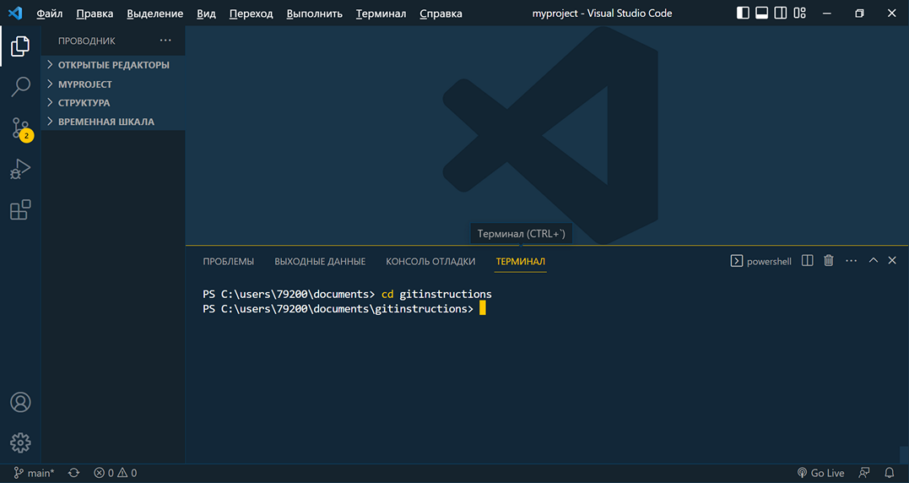

<style>h2{color:#ff4800}</style>

[<< К содержанию](readme.md)

---

## Создание папки проекта

Создавать папку проекта будем не выходя из VS Code в терминале. Для этого перейдем сначала в каталог, в котором будет создана наша папка, с помощью следующей команды:

```powershell
cd [directory]
```

Где _[directory]_ - путь к нужному нам каталогу. Я перехожу в папку "Документы" текущего пользователя из корня диска С, и моя команда выглядит так:

```powershell
cd users/79200/documents
```

На вашем компьютере путь до каталога, естественно, может отличаться.

Теперь с помощью команды mkdir в папке "Документы" создадим папку для нашего проекта и назовем ее GitInstructions:

```powershell
mkdir GitInstructions
```

И перейдем в нее с помощью команды _cd_ (фото 11).


_Фото 11. Переход в папку проекта_

В VS Code также можно перейти в папку проекта: Файл > Открыть папку. Теперь мы можем создать новый репозиторий на нашем компьютере.

---

[Далее >>](creating-repository.md)
