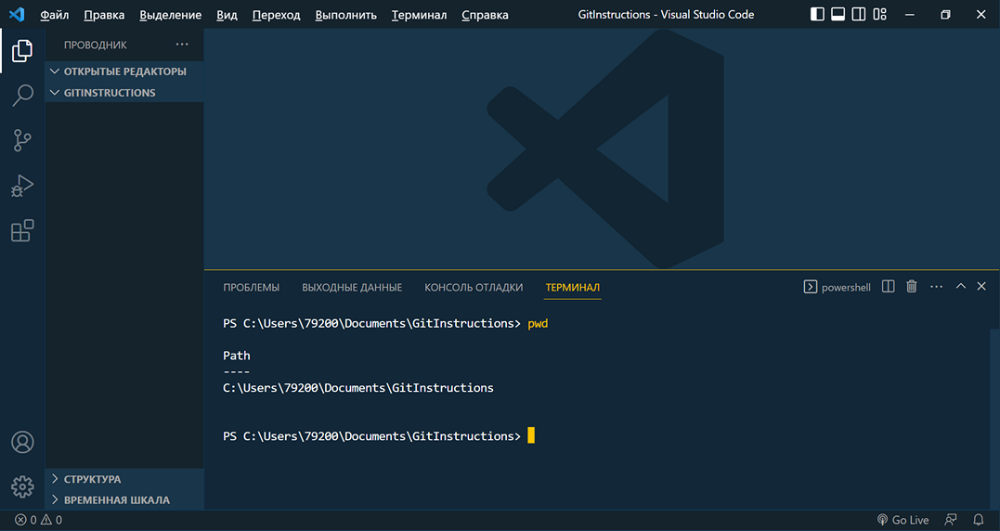
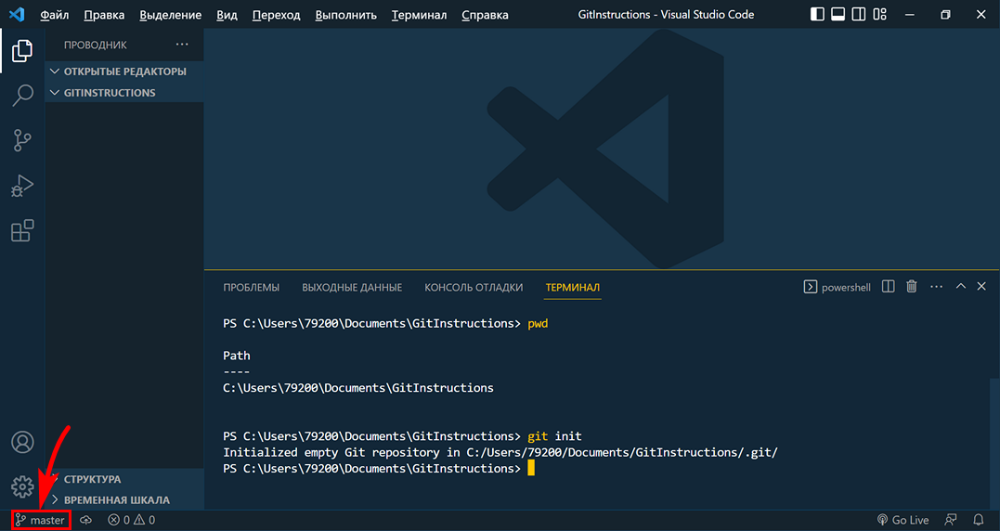

<style>h2{color:#ff4800}</style>

[<< К содержанию](readme.md)

---

## Создание репозитория

Мы уже создали папку для нашего проекта, и теперь можем создать репозиторий непосредственно в этой папке.

Для начала удостоверимся, что мы находимся и работаем в нужной нам папке. Для этого в терминале введем команду:

```powershell
pwd
```


_Фото 12. Проверка текущей директории_

Ответ в терминале подтверждает, что мы в нужной папке. И для создания репозитория используем команду:

```powershell
git init
```

**Важно! Команда _git init_ вводится именно в той папке, где нам нужно создать репозиторий.**

Так как репозиториев может быть много и находиться они могут в разных папках.

Результат выполнения команды _git init_ мы видим на фото 13: в папке нашего проекта создана папка .git и сообщение о создании пустого репозитория. Также в левом нижнем углу появилось название текущей ветки разработки. По умолчанию она называется _master_.


_Фото 13. Создание репозитория_

Папка .git является скрытой папкой и не отображается в VS Code, но мы при желании можем перейти в нее при помощи команды:

```powershell
cd .git
```

и отобразить ее содержимое с помощью команды:

```powershell
ls -Force
```

а затем выйти из нее обратно в нашу папку GitInstructions, используя команду:

```powershell
cd ..
```

Команда _cd и две точки_ позволяет выйти из любого каталога в родительский каталог, то есть на уровень выше.

Теперь у нас есть папка проекта и пустой GIT репозиторий и мы можем наполнить эту папку файлами нашего задания и попробуем сохранить текущую версию проекта, создав первый _коммит_.

---

[Далее >>](creating-commit.md)
