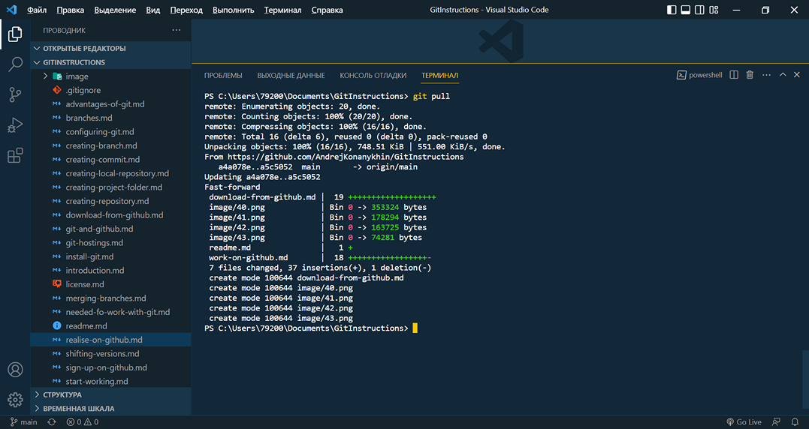
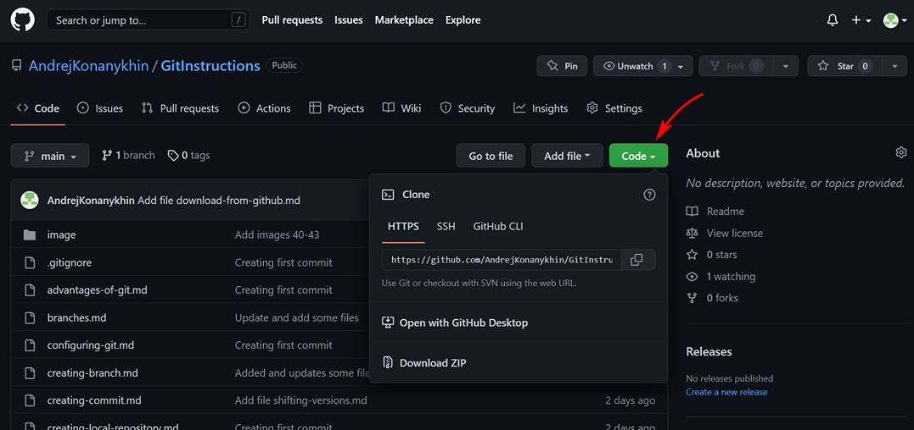

<style>h2{color:#ff4800}</style>

[<< К содержанию](readme.md)

---

## Загрузка изменений с GitHub

Итак мы внесли изменения в ряд файлов, загрузили изображения и создали новый файл download-from-github.md. Таким образом наша локальная версия проекта устарела и уже не содержит новых и модифицированных файлов. Чтобы загрузить изменения с удаленного сервера на локальный, используется команда:

```powershell
git pull
```

Она загрузит все изменения на наш компьютер и применит их. Давайте воспользуемся этой командой и затем продолжим работу на компьютере, а после завершения опубликуем готовый проект на GitHub.

Мы видим результат выполнения команды _git pull_ на фото 44.


_Фото 44. Обновления проекта загружены с удаленного сервера_

Все обновления загружены и применены, файлы в рабочей директории обновились.

А что же делать если локальная версия репозитория была удалена? К счастью, у нас есть удаленная версия на GitHub и мы всегда можем скачать ее на компьютер с помощью команды:

```powershell
git clone [url]
```

где _[url]_ - ссылка на наш удаленный репозиторий на хостинге GitHub. Ссылку можно увидеть, открыв нужный репозиторий и нажав кнопку Code справа (фото 45).


_Фото 45. Ссылка для скачивания удаленного репозитория_

В моем случае команда имеет вид:

```powershell
git clone https://github.com/AndrejKonanykhin/GitInstructions.git
```

Используя подобные ссылки, можно клонировать любые публичные репозитории с GitHub и просматривать их или работать с ними на своем компьютере. Также можно загружать свои собственные репозитории на другой компьютер и работать на нем, если своего компьютера нет под рукой.

---

[Далее >>](conclusion.md)
