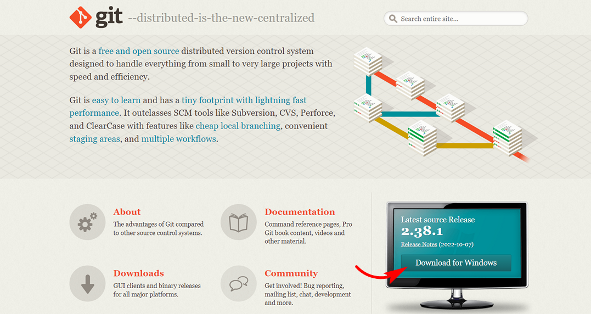

<style>h2{color:#ff4800}</style>

[<< К содержанию](readme.md)

---

## Загрузка и установка GIT

Сначала загрузим на компьютер приложение GIT. Загрузка производится с сайта [git-scm.com](https://git-scm.com/). Нужно выбрать версию, подходящую для нашей операционной системы, хотя обычно сайт автоматически определяет систему и предлагает установить необходимую версию сразу (фото 1).


_Фото 1. Загрузка GIT_

Запустим загруженный файл. В открывшемся окне нажимаем кнопку "Next", то же самое проделываем во всех следующих окнах, оставляя установочные настройки по умолчанию (фото 2).


_Фото 2. Установка GIT_

В последнем окне жмем "Install" (фото 3).


_Фото 3. Установка GIT_

Ждем завершения установки, в конце нажимаем "Finish" (фото 4).


_Фото 4. Завершение установки GIT_

Откроем редактор кода VS Code, запустим терминал. В терминале проверим установку GIT на компьютер. Введем команду:

```powershell
git --version
```

Мы видим, что установка завершена успешно, и версия нашего приложения 2.38.1. для ОС Windows (фото 5).


_Фото 5. Версия GIT_

Рекомендуется всегда устанавливать или обновляться до **_самой свежей версии GIT_**.

Теперь можно приступить к настройке.

---

[Далее >>](configuring-git.md)
