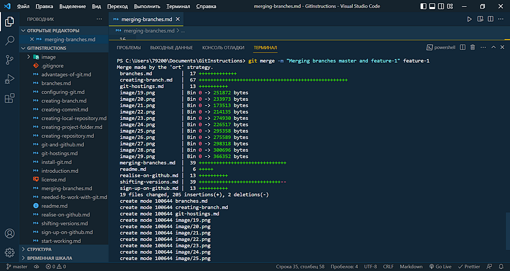

<style>h2{color:#ff4800}</style>

[<< К содержанию](readme.md)

---

## Слияние веток

После создания нового функционала или решения определенной задачи проекта в отдельной ветке, может возникнуть необходимость добавить эти решения в основной проект. Для этого в GIT существует функция объединения веток. Для слияния веток используется команда:

```powershell
git merge [branch name]
```

где _[branch name]_ - имя ветки, которую мы хотим объединить с текущей веткой.

**Важно! Команда _git merge [branch name]_ вводится именно в той ветке, которая является основной, и с которой мы хотим объединить ветку _[branch name]_.**

При объединении веток создается новый коммит, так называемый _merge commit_, этот коммит будет иметь два родительских коммита. В качестве родительских коммитов выступают коммиты, созданные последними в объединяемых ветках. А если посмотреть историю, введя _git log_, мы можем наблюдать все коммиты, созданные в обеих ветках.

В настоящий момент в проекте имеется две ветки _master_ и _feature-1_. Если попереключаться между этими ветками, можно увидеть, что содержимое рабочей области, а также содержимое отдельных файлов, заметно отличаются. В ветке _feature-1_ добавлены новые файлы и обновлен ряд существующих файлов (фото 28, 29).


_Фото 28. Содержимое ветки master_


_Фото 29. Содержимое ветки feature-1_

Дальше мы сохраним все изменения, созданные в ветке _feature-1_ и объединим эту ветку с основной веткой нашего проекта _master_, предварительно перейдя в нее. Кстати в команду _git merge [branch name]_ можно добавить опцию _-m "message"_, то есть можно записать комментарий к merge коммиту, содержащий информацию о слиянии веток. Команда в нашем случае будет иметь вид:

```powershell
git merge -m "Merging branches master and feature-1" feature-1
```

Добавим ее в терминал и посмотрим на результат (фото 30 и 31).


_Фото 30. Обединение веток_


_Фото 31. Запрос git log_

Мы видим информацию о том, какие файлы были изменены и/или добавлены в ветку _master_. Дальнейшую работу будем производить в основной ветке, а ветку _feature-1_ можно удалить. Для удаления используем команду:

```powershell
git branch -d feature-1
```

Видим сообщение, что ветка _feature-1_ удалена (фото 32).


_Фото 32. Ветка feature-1 удалена_

Теперь закоммитим все изменения в основной ветке, а затем переименуем ее в ветку _main_. Для этого используем команду:

```powershell
git branch -m main
```

Теперь наш проект готов к публикации на хостинге GIT репозиториев GitHub. Как это делается, и о том как осуществляется обмен данными с удаленным репозиторием рассмотрим далее.

---

[Далее >>](git-hostings.md)
