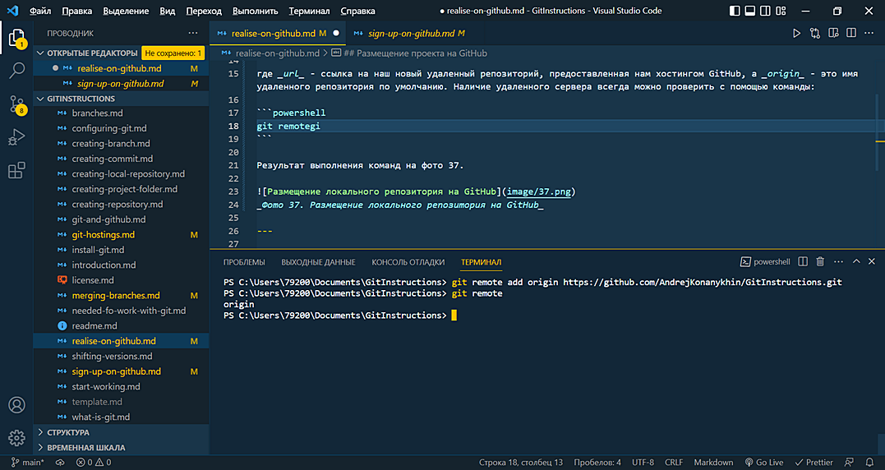
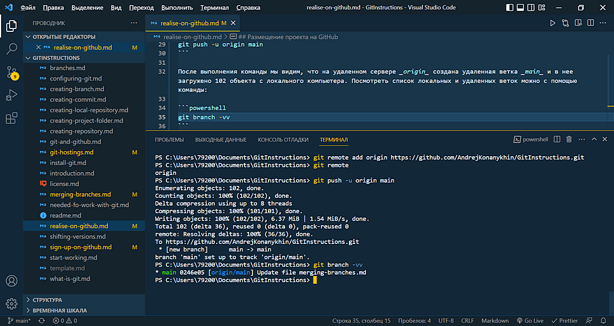
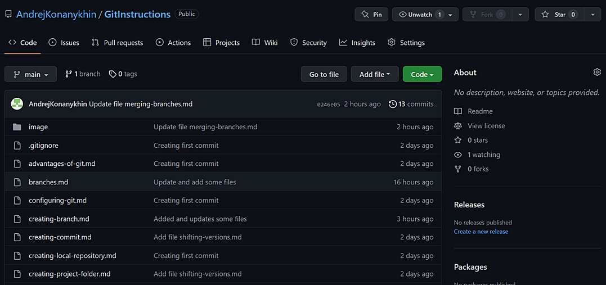
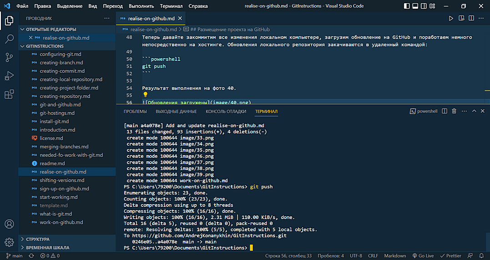

<style>h2{color:#ff4800}</style>

[<< К содержанию](readme.md)

---

## Размещение проекта на GitHub

Итак, у нас есть локальный репозиторий на компьютере и пустой удаленный репозиторий на хостинге GitHub. Давайте теперь разместим локальный репозиторий на хостиге. Это делается с помощью команды:

```powershell
git remote add origin [url]
```

где _url_ - ссылка на наш новый удаленный репозиторий, предоставленная нам хостингом GitHub, а _origin_ - это имя удаленного сервера по умолчанию. Наличие удаленного сервера (или серверов) всегда можно проверить с помощью команды:

```powershell
git remote
```

Результат выполнения команд на фото 37.


_Фото 37. Создание удаленного сервера_

Удаленный сервер создан. Далее GitHub рекомендует переименовать нашу основную ветку в ветку с названием _main_, что мы предусмотрительно сделали заранее. Теперь нам осталось лишь загрузить все данные из локального репозитория в удаленный с помощью следующей команды:

```powershell
git push -u origin main
```

После выполнения команды мы видим, что на удаленном сервере _origin_ создана удаленная ветка _main_ и в нее загружено 102 объекта с локального компьютера. Посмотреть список локальных и удаленных веток можно с помощью команды:

```powershell
git branch -vv
```

Мы видим, что у нас теперь есть локальная ветка _main_ и удаленная ветка _main_ на удаленном сервере _origin_ (фото 38).


_Фото 38. Размещение проекта на удаленном сервере_

И перейдя на GitHub в наш репозиторий GitInstructions мы увидим, что все файлы с локального компьютера размещены на хостинге (фото 39).


_Фото 39. Проект опубликован на GitHub_

Теперь давайте закоммитим все изменения локальном компьютере, загрузим обновление на GitHub и поработаем немного непосредственно на хостинге. Обновления локального репозитория закачиваются в удаленный командой:

```powershell
git push
```

Результат выполнения на фото 40.


_Фото 40. Обновления проекта загружены на удаленный сервер_

---

[Далее >>](work-on-github.md)
