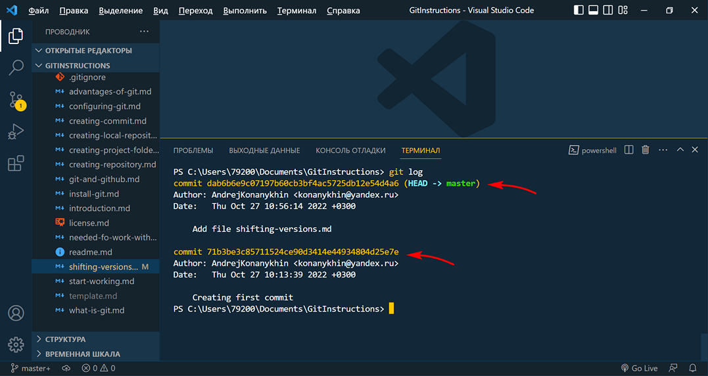
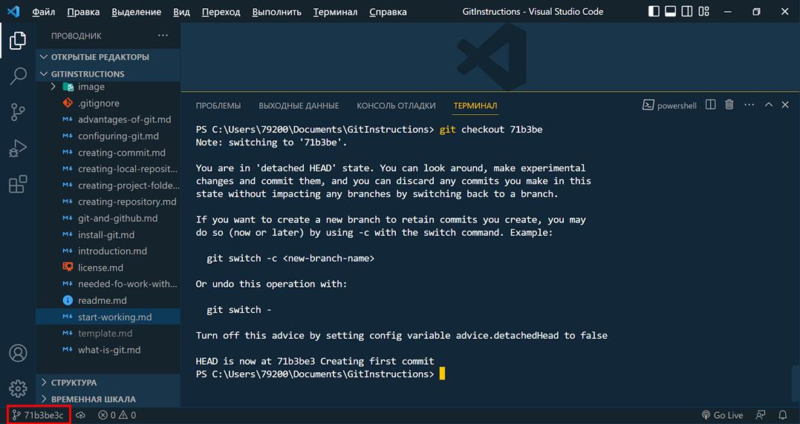
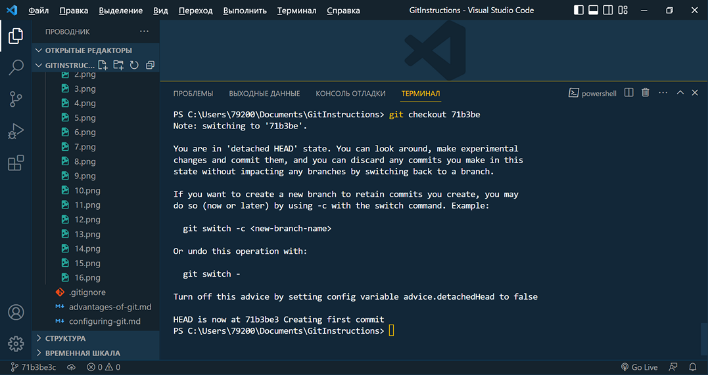
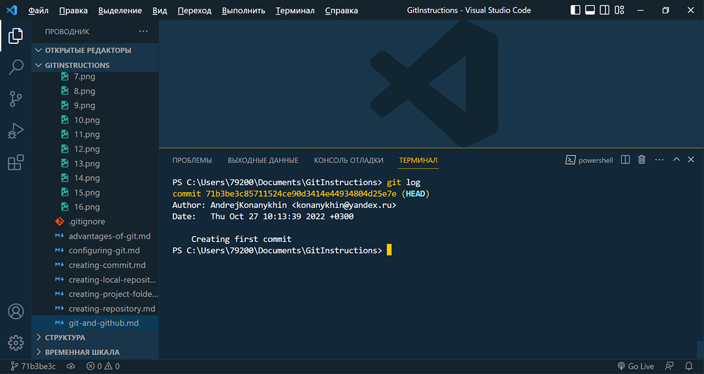
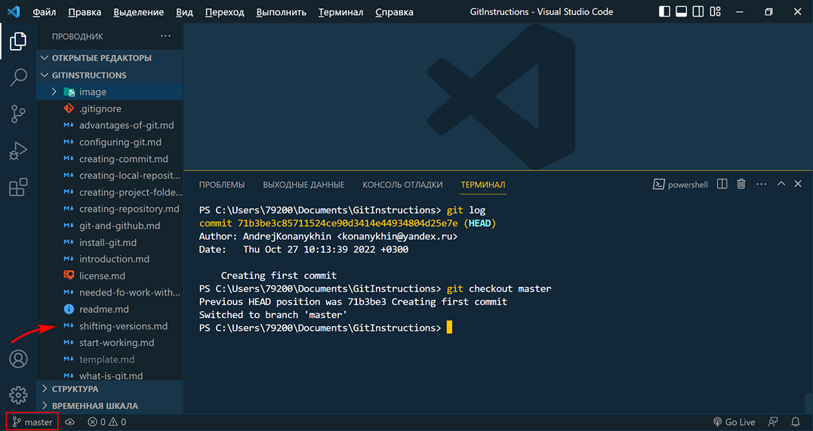
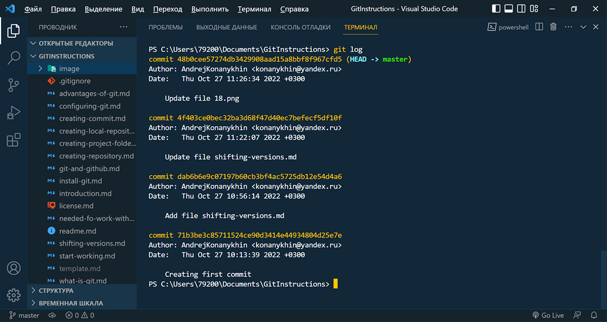

<style>h2{color:#ff4800}</style>

[<< К содержанию](readme.md)

---

## Переключение между версиями проекта

Мы создали новый файл в нашем проекте _shifting-versions.md_. Сохраним файл и создадим новый коммит. Команды мы уже знаем:

```powershell
git add .
git commit -m "Add file shifting-versions.md"
```

В описании коммита укажем, что в проекте появился новый файл _shifting-versions.md_. Так как в процессе описания нашей работы, текущий файл постоянно изменяется, придется создать еще один коммит.

```powershell
git commit -m "Update file shifting-versions.md"
```

Историю всех версий проекта (коммитов) мы можем отслеживать с помощью команды:

```powershell
git log
```


_Фото 18. Новый коммит_

В терминале мы видим три коммита. Обратим внимание, что каждый из них имеет уникальный хэш-индекс. При этом мы видим указатель HEAD, он указывает, что именно та версия, на которую ссылается данный коммит отображается в рабочей области проекта. По умолчанию указатель HEAD всегда ссылается на последнюю актуальную версию проекта (коммит).

И теперь, используя команду:

```powershell
git checkout [commit hash]
```

где _[commit hash]_ - это хэш индекс коммита, ссылающегося на нужную нам версию проекта. При этом весь хэш-индекс вводить не нужно, достаточно 5-6 первых символов.

**Важно! Для переключения между версиями проекта, в рабочей области не должно быть файлов со статусом U, A или М. Иначе переключение не будет осуществлено.**

Давайте сделаем это и посмотрим, как изменяется рабочая область проекта (фото 19, 20).


_Фото 19. Переход к начальной версии проекта_


_Фото 20. Переход к начальной версии проекта_

Мы видим, что среди файлов отсутствует _shifting-versions.md_, который мы добавили позже. Также отсутствуют скриншоты 17, 18 и 19, которые были сделаны при создании последующих коммитов. Еще мы видим, что имя ветки _master_ было изменено на хэш-индекс того коммита, к которому мы осуществили переход.

И при вводе _git log_ мы уже не видим в выводе коммитов, которые были созданы позже (фото 21).


_Фото 21. История коммитов_

Для того, чтобы вернуться к актуальной версии проекта воспользуемся командой:

```powershell
git checkout [branch name]
```

где [branch name] это имя нужной нам ветки, в нашем случае _master_ (фото 22)


_Фото 22. Возврат к актуальной версии проекта_

Теперь мы опять находимся в ветке _master_, и все файлы актуальной версии проекта на своих местах. Проверим:


_Фото 23. История коммитов_

Все коммиты созданные коммиты опять отображаются.

Итак, мы умеем создавать коммиты, переключаться между ними, просматривая различные версии проекта и возвращаться к актуальной версии проекта.

Далее мы создадим новую ветку в нашем проекте и выполним слияние веток.

---

[Далее >>](branches.md)
