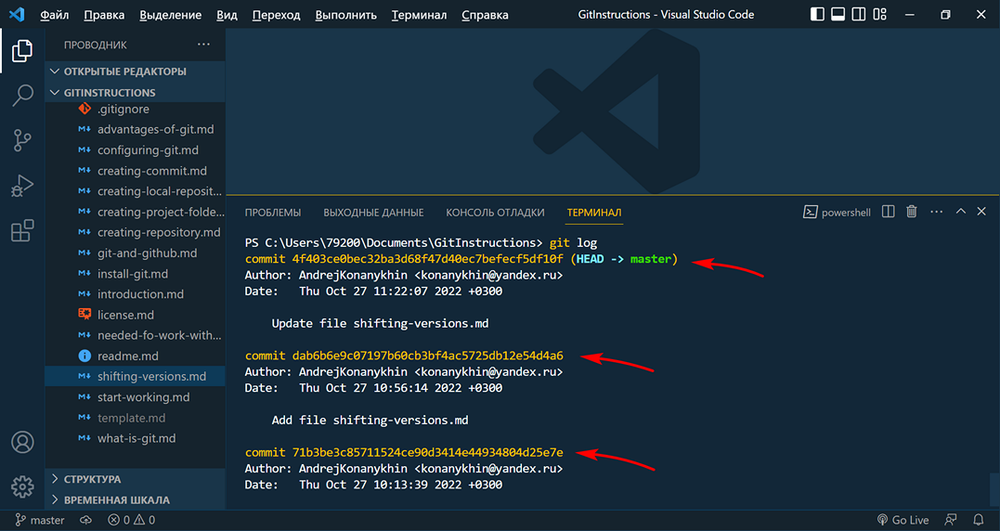

<style>h2{color:#ff4800}</style>

[<< К содержанию](readme.md)

---

## Переключение между версиями проекта

Мы создали новый файл в нашем проекте _shifting-versions.md_. Сохраним файл и создадим новый коммит. Команды мы уже знаем:

```powershell
git add
git commit -m "Add file shifting-versions.md"
```

В описании коммита укажем, что в проекте появился новый файл _shifting-versions.md_. Проверим создание нового коммита с помощью команды:

```powershell
git status
```


_Фото 18. Новый коммит_

Историю всех версий проекта (коммитов) мы можем отслеживать с помощью команды:

```powershell
git log
```

В терминале мы видим два коммита. Обратим внимание, что каждый из них имеет уникальный хэш-индекс. И теперь, используя команду:

```powershell
git checkout [commit hash]
```

где [commit hash] - это хэш индекс коммита, ссылающегося на нужную нам версию проекта. При этом весь хэш-индекс вводить не нужно, достаточно 5-6 первых символов.

Давайте сделаем это и посмотрим, как изменяется рабочая область проекта.

---

[Далее >>](вставить ссылку)
