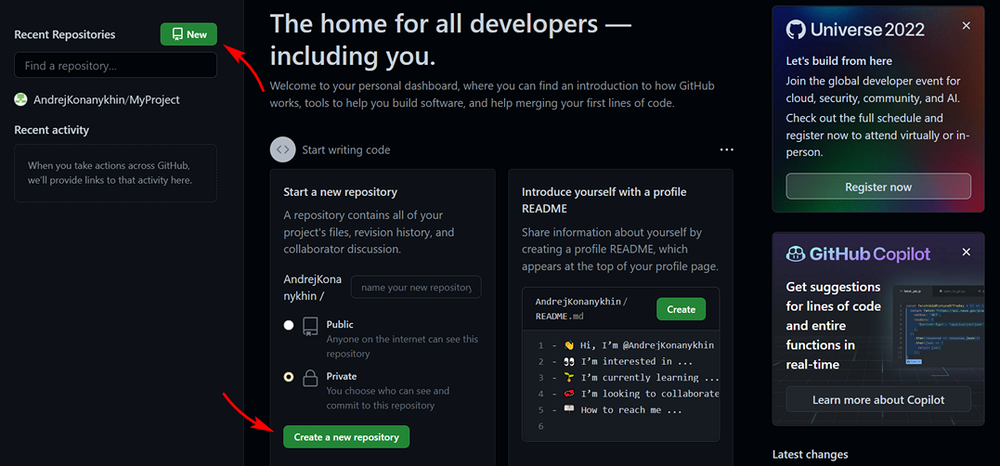

[<< К содержанию](readme.md)

---

## Начало работы на GitHub

Первым делом мы должны зарегистрироваться на GitHub. Для этого перейдем на сервис по [ссылке](https://github.com/). И зайдем на страничку _Sign up_ (фото 34).

_Фото 34. Регистрация на GitHub_

Далее вводим имя пользователя, пароль и почту, подтверждаем email. Страница создана, и теперь мы можем создать собственный удаленный репозиторий. Жмем кнопку _Create a new repository_ или просто _New_ слева (фото 35). Мы также можем выбрать, будет ли новый репозиторий общедоступным - _public_
либо приватным - _private_. Общедоступные репозитории доступны всем пользователям GitHub, приватные только самому создателю и тому, кому создатель приватного репозитория предоставит доступ к этому репозиторию.

_Фото 35. Создание репозитория на GitHub_

Мы создадим _public_ репозиторий и назовем его GitInstructions, как наш проект на локальном компьютере. После создания репозитория на хостинге сервис GitHub предоставит нам ссылку на этот репозиторий, а также необходимые команды для связи локального и удаленного репозиториев (фото 36). Используя эти команды мы можем создать новый локальный репозиторий или связать существующий локальный репозиторий с удаленным.

_Фото 36. Новый репозиторий GitHub_

Дальше мы опубликуем наш проект на GitHub и свяжем локальный и удаленный репозитории.

---

[Далее >>](realise-on-github.md)
