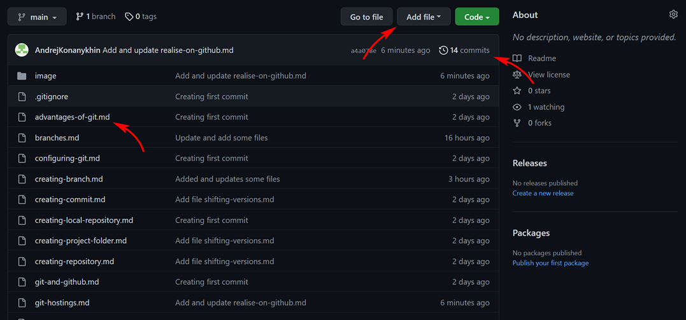
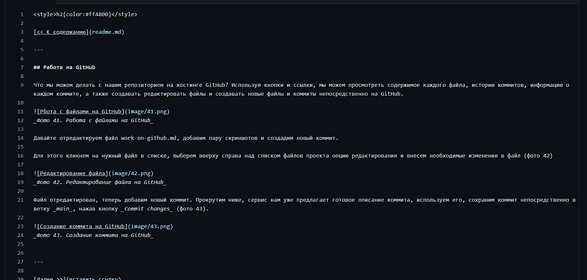
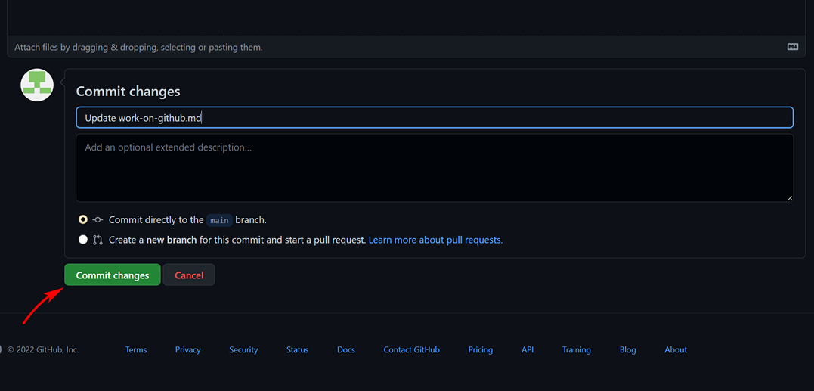

[<< К содержанию](readme.md)

---

## Работа на GitHub

Что мы можем делать с нашим репозиторием на хостинге GitHub? Используя кнопки и ссылки, мы можем просмотреть содержимое каждого файла, историю коммитов, информацию о каждом коммите, а также редактировать файлы и создавать новые файлы и коммиты непосредственно на GitHub.

_Фото 41. Работа с файлами на GitHub_

Давайте отредактируем файл work-on-github.md, добавим пару скриншотов и создадим новый коммит.

Для этого кликнем на нужный файл в списке, выберем вверху справа над списком файлов проекта опцию редактирования и внесем необходимые изменения в файл (фото 42)

_Фото 42. Редактирование файла на GitHub_

Файл отредактирован, теперь добавим новый коммит. Прокрутим ниже, сервис нам уже предлагает готовое описание коммита, используем его, сохраним коммит непосредственно в ветку _main_, нажав кнопку _Commit changes_ (фото 43).

_Фото 43. Создание коммита на GitHub_

---

[Далее >>](download-from-github.md)
